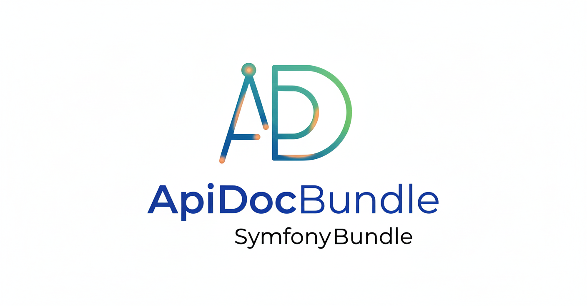

<div align="center">
  
</div>

# ApiDocBundle

A Symfony Bundle to generate and display API documentation using **OpenAPI (Swagger) v3**.
Define your documentation using **YAML files**, **PHP classes**, or a mix of both!

## ✨ Features

- **Multiple UIs supported**: Swagger UI, Redoc, Stoplight Elements, RapiDoc, and Scalar.
- **Flexible Configuration**: Use YAML files, PHP classes, or both.
- **Generator Commands**: CLI tools to quickly generate Schemas, Request Bodies, and Routes.
- **Hybrid Support**: Seamlessly merge YAML and PHP definitions.
- **Attributes Support**: Link your Controllers to their documentation for easy IDE navigation.

---

## 📚 Table of Contents

- [Installation](#installation)
- [Configuration](#configuration)
  - [UI Selection](#ui-selection)
- [Usage](#usage)
  - [1. YAML Configuration](#1-yaml-configuration)
  - [2. PHP Configuration](#2-php-configuration-classes)
  - [3. IDE Integration](#3-ide-integration)
- [Component Generation](#component-generation)

---

## Installation

### 1. Allow Contrib Recipes
Ensure Symfony Flex allows contrib recipes:
```bash
composer config extra.symfony.allow-contrib true
```

### 2. Install the Bundle
```bash
composer require ehyiah/apidoc-bundle
```

---

## Configuration

### Bundle Configuration
The default configuration is automatically installed in `config/packages/ehyiah_api_doc.yaml`.

```yaml
# config/packages/ehyiah_api_doc.yaml
ehyiah_api_doc:
    # Select your preferred UI
    ui: swagger  # Options: swagger, redoc, stoplight, rapidoc, scalar

    # Directory where YAML files are located (and where commands look for existing files)
    source_path: 'src/Swagger'

    # Directory to dump generated files
    dump_path: 'src/Swagger/dump'

    # Enable or disable PHP config loading
    enable_php_config: true

    # Directories to scan for Entity generation
    scan_directories:
        - 'src/Entity'
```

### Environment Variables
You can globally configure your API server URLs in your `.env` file. These will appear in the "Servers" dropdown of the Swagger UI. (this is not mandatory as you can define them in YAML or PHP files too).

```dotenv
# .env
EHYIAH_API_DOC_SITE_URLS=https://api.example.com,http://localhost:8000
```

### Custom URL
The documentation is available at `/ehyiah/api/doc` by default. You can customize this route in `config/routes/ehyiah_api_doc.yaml`.

---

## UI Selection

You can choose from 5 modern UIs to display your documentation.

| UI | Value | Description | Try it out | Links |
|:---|:------|:------------|:-----------|:------|
| **Swagger UI** | `swagger` | The standard, widely used | ✅ Yes | [GitHub](https://github.com/swagger-api/swagger-ui) - [Demo](https://petstore.swagger.io/) |
| **Redoc** | `redoc` | Clean, elegant 3-column layout | ❌ No | [GitHub](https://github.com/Redocly/redoc) - [Demo](https://redocly.github.io/redoc/) |
| **Stoplight Elements** | `stoplight` | Modern, customizable | ✅ Yes | [GitHub](https://github.com/stoplightio/elements) - [Demo](https://elements-demo.stoplight.io/) |
| **RapiDoc** | `rapidoc` | Lightweight, dark/light themes | ✅ Yes | [GitHub](https://github.com/rapi-doc/RapiDoc) - [Demo](https://rapidocweb.com/examples.html) |
| **Scalar** | `scalar` | Beautiful, modern design | ✅ Yes | [GitHub](https://github.com/scalar/scalar) - [Demo](https://docs.scalar.com/swagger-editor) |

### Switching UI On-the-Fly
You can switch the interface dynamically using the `ui` query parameter:
- `https://your-domain/ehyiah/api/doc?ui=redoc`
- `https://your-domain/ehyiah/api/doc?ui=scalar`

---

## Usage

### 1. YAML Configuration
Place your OpenAPI YAML files in the directory defined by `source_path` (default: `src/Swagger`). The bundle will automatically parse and merge all `.yaml` and `.yml` files in this folder.

**Example `src/Swagger/info.yaml`:**
```yaml
documentation:
    openapi: 3.0.0
    info:
        title: My Awesome API
        description: API documentation
        version: 1.0.0
    components:
        securitySchemes:
            Bearer:
                type: http
                scheme: bearer
                bearerFormat: JWT
```

### 2. PHP Configuration Classes
You can define your documentation programmatically using PHP classes. This offers strong typing and IDE autocompletion.

1. Create a class that implements `Ehyiah\ApiDocBundle\Interfaces\ApiDocConfigInterface`.
2. Implement the `configure` method.
3. Your class is automatically autoloaded and parsed.

**Example `src/ApiDoc/UserDocConfig.php`:**
```php
<?php
namespace App\ApiDoc;

use Ehyiah\ApiDocBundle\Builder\ApiDocBuilder;
use Ehyiah\ApiDocBundle\Interfaces\ApiDocConfigInterface;

class UserDocConfig implements ApiDocConfigInterface
{
    public function configure(ApiDocBuilder $builder): void
    {
        $builder
            ->addRoute()
                ->path('/api/users/{id}')
                ->method('GET')
                ->summary('Get user by ID')
                ->tag('Users')
                ->response(200)
                    ->description('User details')
                    ->jsonContent()
                        ->ref('#/components/schemas/User')
                    ->end()
                ->end()
            ->end();
    }
}
```

> 💡 **Tip:** While PHP config classes can be placed anywhere in `src/`, it is recommended to keep them in `src/Swagger` (or your `source_path`) if you want the **Generator Commands** to detect them and prevent duplicates.

📚 **[Read full PHP Config Documentation](docs/PHP_CONFIG_CLASSES.md)**

### 3. IDE Integration
Link your Controller methods to their documentation using the `#[ApiDoc]` attribute. This allows you to Ctrl+Click from your Controller directly to the documentation source.

```php
use Ehyiah\ApiDocBundle\Attributes\ApiDoc;
use App\ApiDoc\UserDocConfig;

class UserController
{
    #[ApiDoc(UserDocConfig::class)]
    public function getUser(int $id) { /* ... */ }
}
```

---

## Component Generation

This bundle provides CLI commands to help you kickstart your documentation by generating Schemas and Request Bodies from your existing PHP classes (Entities, DTOs).

| Command                         | Description                                     | Mandatory parameter                                               | Example                                                       |
|:--------------------------------|:------------------------------------------------|-------------------------------------------------------------------|:--------------------------------------------------------------|
| `apidocbundle:component:schema` | Generates a shared **Schema** from a PHP Class. | No, an autocomplete will prompt you to choose a class             | `bin/console apidocbundle:component:schema "App\Entity\User"` |
| `apidocbundle:component:body`   | Generates a **Request Body** from a PHP Class.  | No, an autocomplete will prompt you to choose a class             | `bin/console apidocbundle:component:body "App\DTO\UserDTO"`   |
| `apidocbundle:route:generate`   | interactively generates a **Route** path.       | Yes, at the moment, there is no autocomplete for route generation | `bin/console apidocbundle:route:generate /my/path`            |

### Command Options

| Option              | Used in | Shortcut | Description                                         |
|:--------------------|---------|:---------|:----------------------------------------------------|
| `--format`          | All     | `-f`     | Output format: `yaml` (default), `php`, or `both`.  |
| `--output`          | All     | `-o`     | Custom output directory (relative to project root). |
| `--tag`             | Route   | `-t`     | (Route only) Tags to associate with the route.      |
| `--response-schema` | Route   | `-rs`    | (Route only) Reference schema for the response.     |
| `--request-body`    | Route   | `-rb`    | (Route only) Reference schema for the request body. |
| `--description`     | Route   | `-d`     | (Route only) Description for the route.             |

📚 **[Read the Full Guide on References](docs/REFERENCES.md)**


### Duplicate Detection
The commands are smart! They check if a component with the same name already exists:
- **Same Format**: Warns you and shows a diff before overwriting.
- **Cross Format**: Warns you if you try to generate a YAML component when a PHP version already exists (and vice-versa).

---

## Linting & Exporting
You can export your entire documentation to a single JSON or YAML file, which is useful for CI/CD linting (e.g., using [vacuum](https://quobix.com/vacuum/)).

```bash
  # Export to JSON
  bin/console apidocbundle:api-doc:generate --format=json
  
  # Export to YAML
  bin/console apidocbundle:api-doc:generate --format=yaml
```
