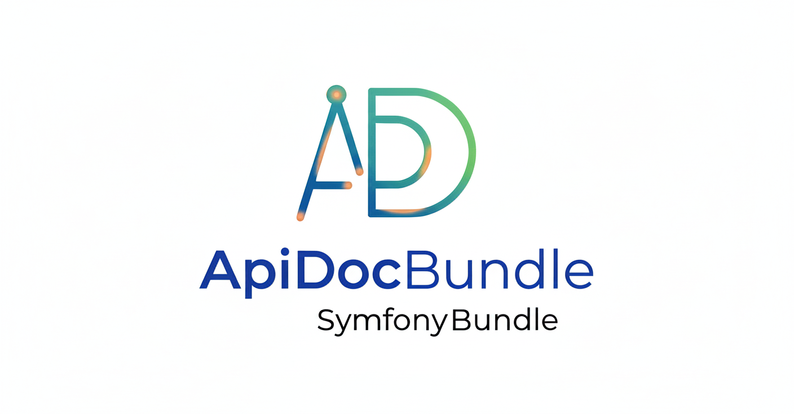

<div align="center">
  
</div>

# ApiDocBundle

A Symfony Bundle to generate and display API documentation using **OpenAPI (Swagger) v3**.
Define your documentation using **YAML files**, **PHP classes**, or a mix of both!

## ✨ Features

- **Multiple UIs supported**: Swagger UI, Redoc, Stoplight Elements, RapiDoc, and Scalar.
- **Flexible Configuration**: Use YAML files, PHP classes, or both.
- **Interactive TUI**: Generate and edit all OpenAPI components via a beautiful terminal interface.
- **Hybrid Support**: Seamlessly merge YAML and PHP definitions.
- **Attributes Support**: Link your Controllers to their documentation for easy IDE navigation.

---

## 📚 Table of Contents

- [Installation](#installation)
- [Configuration](#configuration)
  - [UI Selection](#ui-selection)
- [Usage](#usage)
  - [1. YAML Configuration](#1-yaml-configuration)
  - [2. PHP Configuration](#2-php-configuration-classes)
  - [3. IDE Integration](#3-ide-integration)
- [Component Generation](#component-generation)

---

## Installation

### 1. Allow Contrib Recipes
Ensure Symfony Flex allows contrib recipes:
```bash
composer config extra.symfony.allow-contrib true
```

### 2. Install the Bundle
```bash
composer require ehyiah/apidoc-bundle
```

---

## Configuration

### Bundle Configuration
The default configuration is automatically installed in `config/packages/ehyiah_api_doc.yaml`.

```yaml
# config/packages/ehyiah_api_doc.yaml
ehyiah_api_doc:
    # Select your preferred UI
    ui: swagger  # Options: swagger, redoc, stoplight, rapidoc, scalar

    # Directory where YAML/PHP files are created by default (and where commands look for existing yaml files when editing)
    # PHP files can be placed anywhere after creation because they are loading by their interface and not by scanning directories
    source_path: 'src/Swagger'

    # Directory to dump a full generated file if you want a json/yaml single file output
    # dump_path directory will be excluded from rendering to prevent duplication or overriding from source_path.
    dump_path: 'src/Swagger/dump'

    # Directories to scan for Entity/DTO/Forms schemas generation
    scan_directories:
        - 'src/Entity'
        - 'src/DTO'
        - ... 
```

### Custom URL
The documentation is available at `/ehyiah/api/doc` by default. You can customize this route in `config/routes/ehyiah_api_doc.yaml`.

---

## UI Selection

You can choose from 5 modern UIs to display your documentation.

| UI | Value | Description | Try it out | Links |
|:---|:------|:------------|:-----------|:------|
| **Swagger UI** | `swagger` | The standard, widely used | ✅ Yes | [GitHub](https://github.com/swagger-api/swagger-ui) - [Demo](https://petstore.swagger.io/) |
| **Redoc** | `redoc` | Clean, elegant 3-column layout | ❌ No | [GitHub](https://github.com/Redocly/redoc) - [Demo](https://redocly.github.io/redoc/) |
| **Stoplight Elements** | `stoplight` | Modern, customizable | ✅ Yes | [GitHub](https://github.com/stoplightio/elements) - [Demo](https://elements-demo.stoplight.io/) |
| **RapiDoc** | `rapidoc` | Lightweight, dark/light themes | ✅ Yes | [GitHub](https://github.com/rapi-doc/RapiDoc) - [Demo](https://rapidocweb.com/examples.html) |
| **Scalar** | `scalar` | Beautiful, modern design | ✅ Yes | [GitHub](https://github.com/scalar/scalar) - [Demo](https://docs.scalar.com/swagger-editor) |

### Switching UI On-the-Fly
You can switch the interface dynamically using the `ui` query parameter:
- `https://your-domain/ehyiah/api/doc?ui=redoc`
- `https://your-domain/ehyiah/api/doc?ui=scalar`

---

## Usage

### 1. YAML Configuration
Place your OpenAPI YAML files in the directory defined by `source_path` (default: `src/Swagger`). 
The bundle will automatically parse and merge all `.yaml` and `.yml` files in this folder.

**Example `src/Swagger/info.yaml`:**
```yaml
documentation:
    openapi: 3.0.0
    info:
        title: My Awesome API
        description: API documentation
        version: 1.0.0
    servers:
        - url: https://api.example.com
          description: Production server
    components:
        securitySchemes:
            Bearer:
                type: http
                scheme: bearer
                bearerFormat: JWT
```

### 2. PHP Configuration Classes
You can define your documentation programmatically using PHP classes. This offers strong typing and IDE autocompletion.

1. Create a class that implements `Ehyiah\ApiDocBundle\Interfaces\ApiDocConfigInterface`.
2. Add the `#[ApiDocComponent]` attribute with a unique `id`.
3. Implement the `configure` method.
4. Your class is automatically autoloaded and parsed.

The `#[ApiDocComponent]` attribute is **required**. It lets the TUI find and edit your component regardless of file location or class name.

- **`id`** — A unique string that identifies this component. Use the same name as the OpenAPI component key (e.g., for a schema named `User`, use `id: 'User'`). For routes, use the route name (e.g., `id: 'api_users'`).
- **`type`** — Optional. A hint for the TUI (e.g., `'schema'`, `'response'`, `'tag'`). Auto-detected in most cases.

**Example `src/ApiDoc/UserDocConfig.php`:**
```php
<?php
namespace App\ApiDoc;

use Ehyiah\ApiDocBundle\Attributes\ApiDocComponent;
use Ehyiah\ApiDocBundle\Builder\ApiDocBuilder;
use Ehyiah\ApiDocBundle\Interfaces\ApiDocConfigInterface;

#[ApiDocComponent(id: 'api_user_by_id')]
class UserDocConfig implements ApiDocConfigInterface
{
    public function configure(ApiDocBuilder $builder): void
    {
        $builder
            ->addRoute()
                ->path('/api/users/{id}')
                ->method('GET')
                ->summary('Get user by ID')
                ->tag('Users')
                ->response(200)
                    ->description('User details')
                    ->jsonContent()
                        ->ref('#/components/schemas/User')
                    ->end()
                ->end()
            ->end();
    }
}
```

📚 **[Read full PHP Config Documentation](docs/PHP_CONFIG_CLASSES.md)**
📚 **[Read the PHP Builder Reference](docs/BUILDER_REFERENCE.md)**

### 3. IDE Integration
Link your Controller methods to their documentation using the `#[ApiDoc]` attribute. This allows you to Ctrl+Click from your Controller directly to the documentation source.

```php
use Ehyiah\ApiDocBundle\Attributes\ApiDoc;
use App\ApiDoc\UserDocConfig;

class UserController
{
    #[ApiDoc(UserDocConfig::class)]
    public function getUser(int $id) { /* ... */ }
}
```

---

## Component Generation

This bundle provides an interactive terminal UI (TUI) to generate and edit all OpenAPI components.

### Interactive TUI

Run the interactive terminal UI to generate and edit all component types:

```bash
bin/console apidocbundle:component:tui
```

The TUI supports:

| Component | Description |
|:----------|:------------|
| **Schema** | Generate schemas from PHP classes |
| **Route** | Generate route documentation with per-method configuration |
| **Parameter** | Generate reusable request parameters |
| **Header** | Generate HTTP response headers |
| **Response** | Generate response definitions |
| **Request Body** | Generate request body definitions |
| **Security Scheme** | Generate authentication schemes (HTTP, API Key, OAuth2, OpenID Connect) |
| **Example** | Generate data examples |

Features:
- Edit existing components in place (YAML and PHP files)
- Automatic file detection in any subdirectory of `source_path`
- Format choice: YAML or PHP output
- Visual indicators for configured methods (routes)
- Delete components directly from the TUI

> 💡 **Tip:** The TUI automatically detects existing components and updates them in place, even if they're in a non-standard subdirectory.

---

## Linting & Exporting
You can export your entire documentation to a single JSON or YAML file, which is useful for CI/CD linting (e.g., using [vacuum](https://quobix.com/vacuum/)).

```bash
  # Export to JSON
  bin/console apidocbundle:api-doc:generate --format=json
  
  # Export to YAML
  bin/console apidocbundle:api-doc:generate --format=yaml
```
